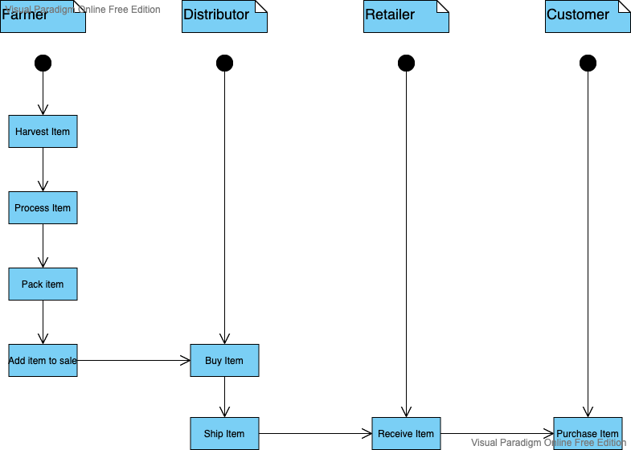
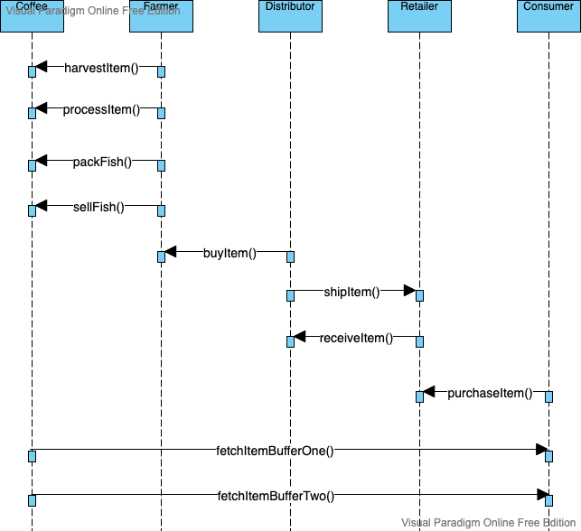
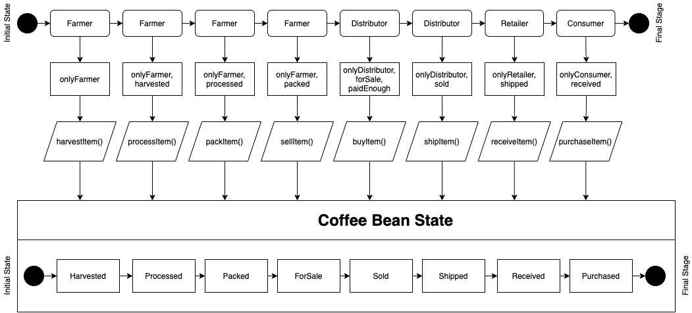
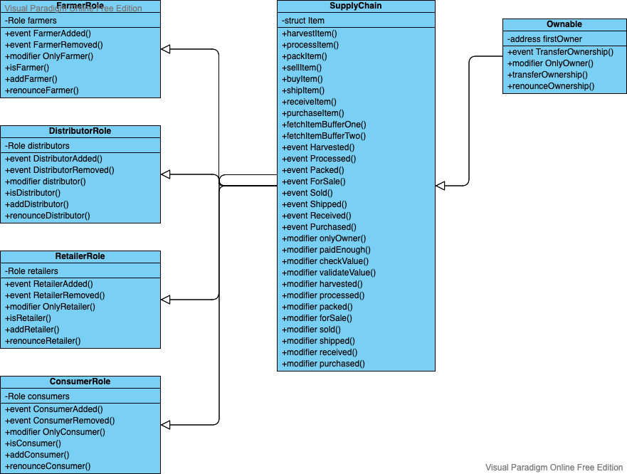

# About the project

This is a project from the Udacity course Blockchain Developer Nanodegree which has the goal to create a DApp supply chain solutions with Ethereum platform. For that, I have diagramed the UML diagrams to show the project's structure, the IPFS hosting and the development itself.

## UML Diagrams

### Activity diagram

<br>
<br>
<br>

### Sequence diagram

<br>
<br>
<br>

### State diagram

<br>
<br>
<br>

### Class diagram

<br>
<br>
<br>

### Libraries

**Truffle**: It was used to develop, test and deploy the smart contracts
**web3**: 

### Tools
**Metamask**: It is the responsible to provide the blockchain in the browser (Chrome extension)

### IPFS
It was used IPFS to help distribute storage across network in a secure way
Application url: [/ipfs/QmW2Mqs4RANGtd9RVuMy8nqMbnjK5foWHQjjWyRmy87xHU](https://gateway.ipfs.io/ipfs/QmW2Mqs4RANGtd9RVuMy8nqMbnjK5foWHQjjWyRmy87xHU)

```
added QmanemXo57QLmJoMtXu6cHkgZSm7n6h1VeCaF8WSnrgPYC dapp-supply-chain/README.md
added QmY9jHxrRbvrtuj75EjhR23YRWJQWRtSmJH7Zb71CtbaXz dapp-supply-chain/bs-config.json
added QmeZyUPazo6DG9sXyp4RkrBtNEY4Tq7ShayzA7LCfPrxCX dapp-supply-chain/build/contracts/ConsumerRole.json
added QmfYtzATeYgzP3FXnAJHi47Py2MLo7Kg3HLgmyJFUZvRF2 dapp-supply-chain/build/contracts/DistributorRole.json
added QmXPEVTPL4V9gLxP8NqQPHgiHcHRtMQGWHu9CEWUStav9E dapp-supply-chain/build/contracts/FarmerRole.json
added QmZTFrEWzC981SYFMY9jQH7YEVaFdSd3ZEeBF2GvftSoKR dapp-supply-chain/build/contracts/Migrations.json
added QmXfU6xNBRusU6nDaY3f1e64UzJZJsm386JR7J2KYbT8z2 dapp-supply-chain/build/contracts/Ownable.json
added QmVEbLrq7npgEmRhXTaknd71PKkA8wth14b7jpYR8Xa3kF dapp-supply-chain/build/contracts/RetailerRole.json
added QmTBpKF1AgQxWFiVixESCVk563ZMg6wMoD8BQizhyN43GH dapp-supply-chain/build/contracts/Roles.json
added QmXWCkWYaFoS1KVg13TJDNYFybo4YxSPsR9FPzFKjfthy7 dapp-supply-chain/build/contracts/SupplyChain.json
added QmRasPvCSRX6P5CLrUQDYifReLd9udcMQHo11U7LFdwx4T dapp-supply-chain/contracts/Migrations.sol
added QmTWiMjGfSRhUhDGF8RUdEJCeRvMceg43oy53xKgC44B6v dapp-supply-chain/contracts/coffeeaccesscontrol/ConsumerRole.sol
added QmZ6jXUWuyG8sALaogJYdZmSzPyLbT2cQYsP5ULv4MdNkj dapp-supply-chain/contracts/coffeeaccesscontrol/DistributorRole.sol
added QmdmPntHrU7VnCTWqk6xmVkTZ8WyuRQc42ViRGsMwXMtPt dapp-supply-chain/contracts/coffeeaccesscontrol/FarmerRole.sol
added QmeN3t2HtnH4rPixTwPZonNMP3DkM36mTqXtA5rVqvT5Qn dapp-supply-chain/contracts/coffeeaccesscontrol/RetailerRole.sol
added QmNk2rbo6HSxsL79BTqnu9QqtpkcknpWskrCZAAmWKpbnJ dapp-supply-chain/contracts/coffeeaccesscontrol/Roles.sol
added Qmbxoak1PrYKCa48StJBYXhUU8T2yi6e7wUBMEsSG91VyN dapp-supply-chain/contracts/coffeebase/SupplyChain.sol
added QmUsDtq1xRzNuPKcnkSxwpbzpzaNpyjb2fMfazq99DbdeC dapp-supply-chain/contracts/coffeecore/Ownable.sol
added QmcxaWKQ2yPkQBmnpXmcuxPZQUMuUudmPmX3We8Z9vtAf7 dapp-supply-chain/migrations/1_initial_migration.js
added QmVCDAeiiBFQ8DYtmWHzwJZCEYwH3jsTPoeXFjvzrUS5jB dapp-supply-chain/migrations/2_deploy_contracts.js
added QmdrTeNk5ko4HCD1hkPEMvNriiag8MFxCp84GcNXTnZmwX dapp-supply-chain/package-lock.json
added QmSnvD4uRcvuv6b2b16XC2yEWbVeQoqXpT7rkaJRjXd3NH dapp-supply-chain/package.json
added QmRGyHz9EX7R9rcGQop27YWuqKcHcpgo9MkD5ADh3fS6pn dapp-supply-chain/test/TestSupplychain.js
added QmeHZ9WH9WKg1xd4TTXfRMA8WJzLEEnbHoBmntWW93PmEe dapp-supply-chain/truffle-config.js
added QmcV2nHXWvhZHJ4mDKNzxKc68N5f45RPfxispwSsnuf37U dapp-supply-chain/uml/activity_diagram.png
added QmTQv9D2a3uN9Yhkmd1nty4bFkajGg68gwZLeSB7ac2Qoi dapp-supply-chain/uml/class_diagram.png
added QmQYW9PuzuWUQdJxfkcHxBLvPvNZyvcC4fhjebcFkJyh56 dapp-supply-chain/uml/sequence_diagram.png
added QmUQ3H5oubtx9LtSzqvDRecKtTQdSMgyoETqWusZ6ThV1P dapp-supply-chain/uml/state_diagram.png
added QmRXgpSSdL5vpvepVqJ8KAQw3vMgiJiezgUcothzqXzWam dapp-supply-chain/website/css/style.css
added QmQJ2GBjWx17NYDRvSNXpJptkBWbpbTTryCrD9pkxEqXDn dapp-supply-chain/website/index.html
added QmPvGD4NVodLhyAaBy7QjfPqnVkyMKHGVxC8LkLWmfwjtz dapp-supply-chain/website/js/app.js
added QmW5qd5uHjzK5JnEkXJ5LzpYaNTna2xY4k5myZKF9hUzJL dapp-supply-chain/website/js/truffle-contract.js
added QmXFb8xLGqbb38cwzSoohvvDxmAZzd9YEEG5HeserY8dUG dapp-supply-chain/build/contracts
added QmRsidEHS9ALQ9SqZkK4vWkCTaivgqjGJvLmpPZu5HMiMR dapp-supply-chain/build
added QmbHJ5QFtX5LTggPvHCK3uxowmbCmse23HKoK3GjBSisfq dapp-supply-chain/contracts/coffeeaccesscontrol
added QmXEctJwYrTdd6ZWm9eqPCtLGJwA1neK8fLg87gdL5MmgN dapp-supply-chain/contracts/coffeebase
added QmexMr1JrcCDGgwhLcLVfZTRVFWaaJgc3cJPYbVUVGDf85 dapp-supply-chain/contracts/coffeecore
added QmdbPB7bvZ573LAyGieWypSYcdvAZVhi3p7P5mUYUi2AL3 dapp-supply-chain/contracts
added QmYkxkeaQ8GJyrxhA7htwcDsqN8P2K8WH7f8paX3moquLk dapp-supply-chain/migrations
added QmYFHM1T6shB9bhYsYpdv9RMkMBuFGu3KzLKUG6zfo6QNa dapp-supply-chain/test
added QmVSGxGixLCNJuE7rhPoMxmjx8eWHtQXgb5GVpsydutPqo dapp-supply-chain/uml
added Qmduc63Ld5riL4oBZKXZwJG5tSyMUpWdnNp6EL9kHvmxw8 dapp-supply-chain/website/css
added QmdfG9rWdJF8CeRQR4n8vmaehhzMedF7K4VYccKvzrB4KN dapp-supply-chain/website/js
added QmTBeXqL27iusHLBHrZiEGuZ39Q6n8S66GhA2SNK5CWbgs dapp-supply-chain/website
added QmW2Mqs4RANGtd9RVuMy8nqMbnjK5foWHQjjWyRmy87xHU dapp-supply-chain
```

### Running tests

```
  ✓ Testing smart contract function harvestItem() that allows a farmer to harvest coffee (649ms)
  ✓ Testing smart contract function processItem() that allows a farmer to process coffee (132ms)
  ✓ Testing smart contract function packItem() that allows a farmer to pack coffee (130ms)
  ✓ Testing smart contract function sellItem() that allows a farmer to sell coffee (152ms)
  ✓ Testing smart contract function buyItem() that allows a distributor to buy coffee (238ms)
  ✓ Testing smart contract function shipItem() that allows a distributor to ship coffee (119ms)
  ✓ Testing smart contract function receiveItem() that allows a retailer to mark coffee received (252ms)
  ✓ Testing smart contract function purchaseItem() that allows a consumer to purchase coffee (236ms)
  ✓ Testing smart contract function fetchItemBufferOne() that allows anyone to fetch item details from blockchain (47ms)
  ✓ Testing smart contract function fetchItemBufferTwo() that allows anyone to fetch item details from blockchain (52ms)
```

### Migration

```
Starting migrations...
======================
> Network name:    'develop'
> Network id:      5777
> Block gas limit: 6721975 (0x6691b7)


1_initial_migration.js
======================

   Deploying 'Migrations'
   ----------------------
   > transaction hash:    0x8b6c0fba18e27ebb76f13ecd1ee81e2285077a1b3af0e7f1adbf390da0c5c241
   > Blocks: 0            Seconds: 0
   > contract address:    0x755E57aD7C2E3b2812AdBFEd7a3EFf0f7eea5774
   > block number:        21
   > block timestamp:     1615889483
   > account:             0x6faC2C9572af2Af87A5C9ac980523F2546814F36
   > balance:             99.90354394
   > gas used:            225237 (0x36fd5)
   > gas price:           20 gwei
   > value sent:          0 ETH
   > total cost:          0.00450474 ETH


   > Saving migration to chain.
   > Saving artifacts
   -------------------------------------
   > Total cost:          0.00450474 ETH


2_deploy_contracts.js
=====================

   Deploying 'FarmerRole'
   ----------------------
   > transaction hash:    0x6d091ee202495ed90737044c46218ff7f6004b0ab1570d67a9ff05b09bd3ae16
   > Blocks: 0            Seconds: 0
   > contract address:    0xcdB985B6A83164768ED1B4fCdcb15aE2E3348247
   > block number:        23
   > block timestamp:     1615889483
   > account:             0x6faC2C9572af2Af87A5C9ac980523F2546814F36
   > balance:             99.89605828
   > gas used:            331920 (0x51090)
   > gas price:           20 gwei
   > value sent:          0 ETH
   > total cost:          0.0066384 ETH


   Deploying 'DistributorRole'
   ---------------------------
   > transaction hash:    0xa7b79c6133dd15fb8170b785164aa0fff5700e38fc632ce553aec3d9fff67cad
   > Blocks: 0            Seconds: 0
   > contract address:    0x65812398eA743df6efd8BBa1005b7B5467886046
   > block number:        24
   > block timestamp:     1615889484
   > account:             0x6faC2C9572af2Af87A5C9ac980523F2546814F36
   > balance:             99.88939876
   > gas used:            332976 (0x514b0)
   > gas price:           20 gwei
   > value sent:          0 ETH
   > total cost:          0.00665952 ETH


   Deploying 'RetailerRole'
   ------------------------
   > transaction hash:    0x5e7252a00da9dfc3efb28623bf96132ee146ae609e8cbdbd4b4c968c3982b191
   > Blocks: 0            Seconds: 0
   > contract address:    0x4aF3966E194a71f9F03cfbaf93a12A540142fE09
   > block number:        25
   > block timestamp:     1615889484
   > account:             0x6faC2C9572af2Af87A5C9ac980523F2546814F36
   > balance:             99.88275172
   > gas used:            332352 (0x51240)
   > gas price:           20 gwei
   > value sent:          0 ETH
   > total cost:          0.00664704 ETH


   Deploying 'ConsumerRole'
   ------------------------
   > transaction hash:    0x42434f8fa1338fb7914407c06e1a40f5cfbd56e4c6edf40befd8f138364c3f56
   > Blocks: 0            Seconds: 0
   > contract address:    0x0b54d5811A3D5886aB0b848Acad675E147214D8D
   > block number:        26
   > block timestamp:     1615889484
   > account:             0x6faC2C9572af2Af87A5C9ac980523F2546814F36
   > balance:             99.87610468
   > gas used:            332352 (0x51240)
   > gas price:           20 gwei
   > value sent:          0 ETH
   > total cost:          0.00664704 ETH


   Deploying 'SupplyChain'
   -----------------------
   > transaction hash:    0x38072d596fa752f9441743c881ed15781e42b6b6f108295809bbee267ad647a6
   > Blocks: 0            Seconds: 0
   > contract address:    0x680c05f98304e797aC0241377971b6b5824c44e6
   > block number:        27
   > block timestamp:     1615889484
   > account:             0x6faC2C9572af2Af87A5C9ac980523F2546814F36
   > balance:             99.82033376
   > gas used:            2788546 (0x2a8cc2)
   > gas price:           20 gwei
   > value sent:          0 ETH
   > total cost:          0.05577092 ETH


   > Saving migration to chain.
   > Saving artifacts
   -------------------------------------
   > Total cost:          0.08236292 ETH


Summary
=======
> Total deployments:   6
> Final cost:          0.08686766 ETH
```

### Versions

* Truffle v5.1.63 (core: 5.1.63)
* Solidity v0.5.16 (solc-js)
* Node v14.8.0
* Web3.js v1.2.9